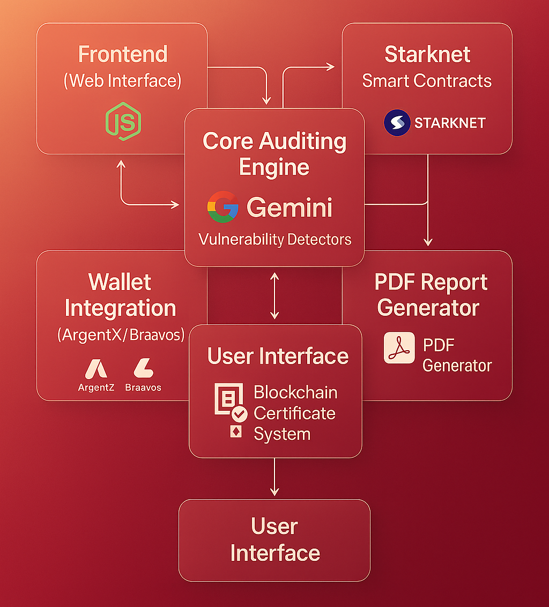

<p align="center">
  
</p>

<h1 align="center">VeriSecure</h1>
<p align="center"><i>AI-Powered Smart Contract Security Auditing Platform Built on Starknet</i></p>

<p align="center">
  <a href="https://starknet.io/"></a>
  <a href="https://ai.google.dev/"></a>
  <a href="https://sepolia.starkscan.co/contract/0x0455c60412d2e77b1763699575163d8a72c75759b2ca6f7124bbe4237baa974c"></a>
  <a href="LICENSE"></a>
</p>

<p align="center">
  <strong>🏆 Built exclusively for the Starknet Re{ignite} Hackathon</strong>
</p>

<p align="center">
  <b>🚀 Deployed on Starknet Sepolia Testnet</b>
</p>


## 🌟 Overview

VeriSecure is a smart tool that helps make blockchain programs safer by finding security problems quickly and easily. It uses advanced artificial intelligence to check code for vulnerabilities and then stores a secure, immutable certificate on the blockchain to prove the program has been properly checked.

**🎯 Problem Solved**: Getting blockchain programs checked for security issues is usually expensive, slow, and hard to verify. VeriSecure makes this process faster, more affordable, and trustworthy for everyone.

## 🏛️ Platform Architecture

<p align="center">
  
</p>


## ✨ Key Features

### 🤖 AI-Powered Security Analysis
- **Google Gemini Integration**: Uses advanced AI to find security problems in smart contracts
- **Multiple Languages**: Supports both Solidity and Cairo programming languages  
- **Automatic Ranking**: Ranks issues as High, Medium, Low, or Informational priority
- **Clear Solutions**: Provides easy-to-understand explanations and how to fix problems

### 🔗 Blockchain Certificate System
- **Permanent Records**: Stores audit certificates forever on the Starknet blockchain
- **Public Verification**: Anyone can check and verify audits on Starkscan
- **Secure Proof**: Provides Cryptographic evidence that audits were completed
- **Easy Wallet Connection**: Works seamlessly with ArgentX and Braavos wallets

### 📊 Professional Reporting Suite  
- **Live Dashboard**: Interactive charts showing real-time analysis results
- **PDF Reports**: Generates a professional audit report you can download
- **Detailed Breakdown**: Shows exactly what types of issues were found and how serious they are

### 🎨 Modern User Experience
- **Glassmorphism-Gradient Design**: Clean, modern interface with smooth animations
- **Theme Options**: Choose between dark and light modes
- **Works Everywhere**: Optimized for desktop, tablet, and mobile devices
- **Drag & Drop**: Simply drag your files to start the audit process

## 🚀 Live Demo & Verification

**📄 Deployed Contract:** `0x0455c60412d2e77b1763699575163d8a72c75759b2ca6f7124bbe4237baa974c`

**🔍 Verify on Starkscan:** [View Live Contract](https://sepolia.starkscan.co/contract/0x0455c60412d2e77b1763699575163d8a72c75759b2ca6f7124bbe4237baa974c)

**🧪 Test the Platform:** [Try VeriSecure Now](https://verisecure-audit.vercel.app/) 

**📋 Sample Audit Report:** [View Generated Report](web/public/audit-report.pdf)
- See what VeriSecure AI-generated reports look like


## 🎯 Complete Usage Workflow

### Step 1: Contract Upload
- Drag & drop or select your `.sol` or `.cairo` contract file  
- Real-time validation ensures compatibility  
- Upload progress indicators

### Step 2: Analysis Configuration
- Enable **AI Analysis**  
- Opt for **PDF Generation**  
- Configure parameters

### Step 3: Security Review
- 📊 Dashboard Overview  
- 🔍 Detailed Vulnerabilities with severity ratings  
- 🤖 AI Insights & remediation suggestions  
- 📄 Downloadable PDF Reports

### Step 4: Blockchain Verification
- 🔗 Connect ArgentX or Braavos wallet  
- ⛓️ Submit certificate to Starknet  
- ✅ Public, immutable audit verification

## 🛠️ Technology Stack

| Layer | Technologies |
|-------|-------------|
| **Frontend** | HTML5, CSS3 (Glassmorphism), JavaScript, Chart.js, Socket.io |
| **Backend** | Node.js, Express.js, Multer (file handling), PDF-Kit |
| **Blockchain** | Starknet (Sepolia), Cairo, Scarb, Starkli |
| **AI/ML** | Google Gemini API, Custom security prompts |
| **Infrastructure** | Git, npm, Real-time WebSocket communication |


## 📁 Project Structure

```
VeriSecure/
├── 🎯 src/                     # Core Auditing Engine
│   ├── ai/                    # Google Gemini integration
│   ├── detectors/             # Vulnerability detection modules
│   ├── parser/                # Multi-language contract parsing
│   └── reporter/              # PDF generation & analytics
├── 🌐 web/                     # Frontend Application
│   ├── public/
│   │   ├── css/style.css      # Glassmorphism UI components
│   │   ├── js/
│   │   │   ├── main.js        # Core frontend logic
│   │   │   └── starknet-integration.js # Blockchain connectivity
│   │   ├── images/            # Branding & assets
│   │   └── index.html         # Main application interface
│   ├── server.js              # Express.js server
│   └── package.json           # Dependencies & scripts
├── ⛓️ starknet-contracts/       # Smart Contract Suite
│   ├── src/audit_registry.cairo # Main audit registry contract
│   ├── Scarb.toml             # Cairo project configuration
│   └── target/                # Compiled contract artifacts
├── 🧪 test/                    # Comprehensive test suite
├── 📋 .gitignore               # Repository security rules
└── 📖 README.md                # Project documentation
```


## 🏃‍♂️ Quick Start Guide

### Prerequisites

Ensure you have the following tools installed:

- Node.js (v16 or higher)  
- [Scarb](https://docs.swmansion.com/scarb/) (Cairo package manager)  
- [Starkli](https://book.starknet.io/docs/hello_starknet/cli.html) (Starknet CLI tools)  
- Git


### 🔧 Installation & Setup

1. **Clone & Navigate**
   ```bash
   git clone https://github.com/yourusername/VeriSecure.git
   cd VeriSecure
   ```

2. **Install Dependencies**
   ```bash
   cd web && npm install
   ```

3. **Environment Configuration**
   ```bash
   cp .env.example .env
   echo "GEMINI_API_KEY=your_google_gemini_api_key" >> .env
   echo "PORT=3000" >> .env
   ```

4. **Build Smart Contracts**
   ```bash
   cd ../starknet-contracts && scarb build
   ```

5. **Launch Application**
   ```bash
   cd ../web && npm start
   ```

Open [http://localhost:3000](http://localhost:3000)


## 🏗️ Smart Contract System

### Audit Registry Architecture

- 📝 Immutable on-chain storage  
- 🔍 Public audit lookup  
- 📊 Track audit stats  
- 🔒 Secure submission flow

### Core Contract Functions (Cairo)

```rust
// Submit a new audit result
fn submit_audit_result(
    contract_hash: felt252,
    score: u8,
    high_issues: u32,
    medium_issues: u32,
    low_issues: u32,
    ipfs_report_hash: felt252
) -> u256

// Query latest audit
fn get_latest_audit_for_contract(contract_hash: felt252) -> AuditResult

// Check audit status
fn is_contract_audited(contract_hash: felt252) -> bool

// Get total audits
fn get_audit_count() -> u256
```


### Key Achievements

- ✅ Full Starknet Integration  
- ✅ AI-Powered Vulnerability Detection  
- ✅ Polished UI/UX  
- ✅ Transparent, Trustless Verification

### Technical Highlights

- **Gas Efficient** design  
- **Modular Architecture**  
- **Security First** validation  
- **Premium User Experience**


## 📄 License

Licensed under the [MIT License](LICENSE)


